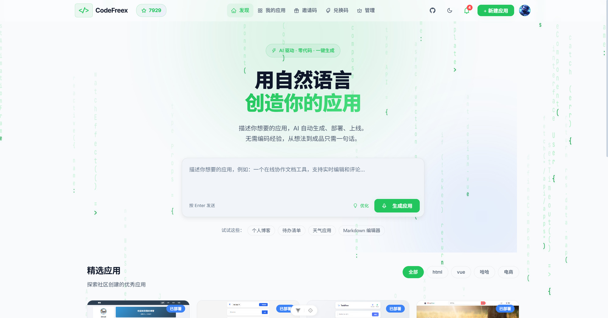
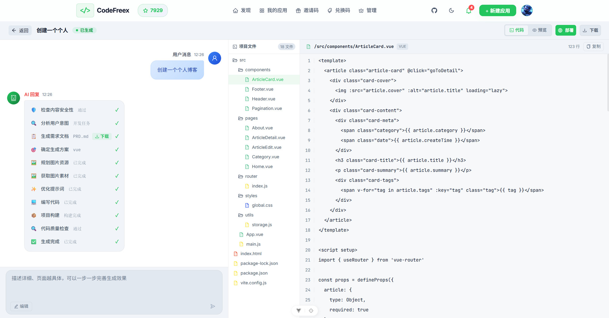
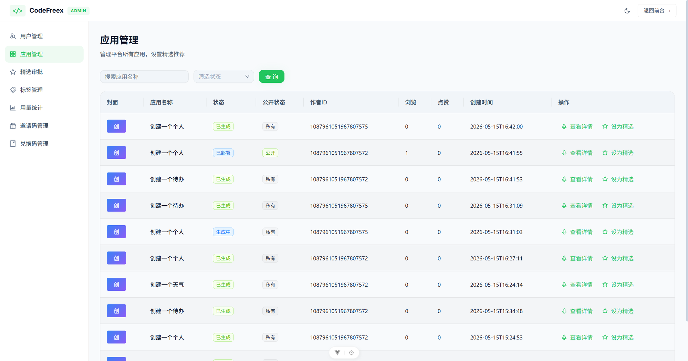

<p align="center">
  
  
  
  
</p>

<h1 align="center">CodeFreex</h1>

<p align="center">
  <strong>AI 驱动的零代码应用生成平台 — 后端</strong>
</p>

<p align="center">
  <a href="https://github.com/userwanyong/codefreex-frontend">前端仓库</a> · <a href="#-快速开始">快速开始</a> · <a href="#-功能特性">功能特性</a> · <a href="#-技术栈">技术栈</a>
</p>

<br />

## 项目简介

CodeFreex 是一个 AI 驱动的零代码应用生成平台。用户只需用自然语言描述想要的应用，AI 即可自动完成需求分析、素材收集、代码生成、质量检查和构建部署，生成可直接运行的前端应用。

本仓库为 CodeFreex 的后端项目，基于 **Spring Boot 3 + LangChain4j + LangGraph4j** 构建，实现了完整的 AI 工作流编排、应用管理、用户系统和后台管理功能。

## 项目速览

<p align="center">
  
</p>
<p align="center">
  
</p>
<p align="center">
  
</p>

## 核心亮点

- **15 节点 AI 工作流引擎** — 基于 LangGraph4j 构建的多步骤智能工作流，覆盖从安全审查到代码部署的完整链路
- **多类型代码生成** — 支持 HTML 单文件、多文件项目、Vue 完整项目三种代码生成模式
- **AI 工具调用** — 代码迭代阶段通过 Tool Calling 实现文件读写、编辑等操作，支持最多 15 轮自动迭代
- **自动质量检查与修复** — AI 自动验证生成代码质量，不通过时自动修复并重试（最多 2 次）
- **智能素材收集** — 自动从 Pexels、Pixabay 获取图片素材，支持 Mermaid 图表渲染和 AI SVG Logo 生成
- **SSE 流式响应** — 基于 Server-Sent Events 的实时流式输出，支持断线重连和事件回放
- **可视化监控** — 内置 Prometheus + Grafana 监控方案，预置 AI 模型调用仪表盘

## 功能特性

### AI 工作流

完整的 15 节点工作流管道，每个节点各司其职：

```
用户输入 → 安全审查 → AI 内容审查 → 意图分类 → ...
                                                    ├── 对话回答 → 直接回复
                                                    ├── 可视化编辑 → Tool Calling 迭代修改
                                                    └── 代码生成 → PRD 生成 → 素材规划 → 素材获取
                                                                  → Prompt 增强 → 类型路由 → 代码生成
                                                                  → 质量检查 → [修复] → 构建 → 持久化
```

- **安全审查** — 关键词过滤 + AI 二次审查，双重保障
- **意图分类** — 自动识别用户意图：代码生成 / 可视化编辑 / 普通对话
- **PRD 生成** — AI 自动生成产品需求文档，指导后续代码生成
- **素材规划与获取** — 自动规划所需图片类型，从多个来源获取素材
- **代码类型路由** — AI 智能判断最适合的代码生成模式
- **流式代码生成** — 大模型流式输出代码，实时展示生成过程
- **自动修复循环** — 质量检查失败时自动修复，最多重试 2 次

### 应用管理

- 应用创建、编辑、删除
- 一键部署（Nginx 集成）
- 应用封面自动截图（Selenium 无头浏览器）
- 精选应用推荐与审批工作流
- 应用点赞、浏览统计
- 源码下载

### 用户系统

- 邮箱 + 验证码注册，密码登录
- 微信小程序扫码登录（Authing SDK）
- Spring Session (Redis) 有状态认证
- 角色权限控制（管理员 / 平台管理员）
- 积分体系与交易账本
- 邀请码与兑换码系统

### 管理后台

- 用户管理（列表、禁用、积分调整）
- 应用管理（列表、精选推荐）
- 精选审批工作流（申请 → 审核 → 上线）
- 标签管理
- 用量统计（Token 消耗、延迟、错误率）
- 邀请码 / 兑换码批量管理

### 监控

- Spring Boot Actuator + Micrometer Prometheus 端点
- 预置 Grafana AI 监控仪表盘
- Docker Compose 一键启动 Prometheus + Grafana

## 技术栈

| 类别 | 技术 | 版本 |
|------|------|------|
| 语言 | [Java](https://openjdk.org/) | 21 |
| 框架 | [Spring Boot](https://spring.io/projects/spring-boot) | 3.5 |
| AI 编排 | [LangChain4j](https://langchain4j.dev/) | 1.13 |
| 工作流引擎 | [LangGraph4j](https://github.com/langgraph4j/langgraph4j) | 1.1 |
| ORM | [MyBatis-Flex](https://mybatis-flex.com/) | 1.11 |
| 数据库 | [MySQL](https://www.mysql.com/) | 8.x |
| 缓存 | [Redis](https://redis.io/) + [Redisson](https://redisson.org/) | — |
| 会话 | Spring Session (Redis) | — |
| RPC | [Apache Dubbo](https://dubbo.apache.org/) | 3.3 |
| 注册中心 | [Nacos](https://nacos.io/) | 2.4 |
| API 文档 | [Knife4j](https://doc.xiaominfo.com/) (OpenAPI 3) | 4.4 |
| 对象存储 | [阿里云 OSS](https://www.aliyun.com/product/oss) | — |
| 身份认证 | [Authing](https://www.authing.cn/) | — |
| 浏览器自动化 | [Selenium](https://www.selenium.dev/) | 4.33 |
| 监控 | Micrometer + Prometheus + Grafana | — |

## 项目结构

```
src/main/java/cn/wanyj/codefreex/
├── auth/                       # 认证鉴权
│   ├── annotation/             # @AuthCheck 自定义注解
│   ├── aspect/                 # AuthCheckAspect (AOP)
│   ├── AuthRpcClient.java      # Dubbo RPC 客户端
│   └── UserContext.java        # ThreadLocal 用户上下文
├── common/                     # 公共模块
│   ├── BaseResponse.java       # 统一响应包装
│   ├── PageRequest/Response    # 分页 DTO
│   └── ResultUtils.java        # 响应工具类
├── config/                     # 配置类
│   ├── AiConfig.java           # LangChain4j 模型 + Prompt 配置
│   ├── AppRuntimeConfig.java   # 应用运行时配置
│   ├── MybatisFlexConfig.java  # MyBatis-Flex 配置
│   └── ...
├── controller/                 # REST API 控制器（21 个）
├── exception/                  # 全局异常处理
├── mapper/                     # MyBatis-Flex Mapper（14 个）
├── model/
│   ├── dto/                    # 数据传输对象
│   │   ├── request/            # 请求 DTO（13 个）
│   │   └── response/           # 响应 DTO（10+ 个）
│   ├── entity/                 # 数据库实体（10 张表）
│   └── enums/                  # 枚举（7 个）
├── ratelimit/                  # Redisson 限流
│   ├── annotation/             # @RateLimit 注解
│   └── aspect/                 # RateLimitAspect
├── service/                    # 业务逻辑接口（18 个）
│   ├── impl/                   # 业务实现（25+ 个）
│   ├── strategy/               # 策略模式
│   │   └── impl/               # 代码持久化策略（HTML/多文件/Vue 项目）
│   └── tools/                  # AI Tool Calling 文件操作工具
└── workflow/                   # AI 工作流（LangGraph4j）
    └── nodes/                  # 15 个工作流节点
```

### 资源文件

```
src/main/resources/
├── prompts/                    # AI Prompt 模板（19 个文件）
├── application.yml             # 主配置
├── application-local.yml       # 本地开发配置
└── logback-spring.xml          # 日志配置

docs/
├── sql/
│   └── init.sql                # 数据库初始化脚本（14 张表）
└── grafana/
    ├── docker-compose.yml      # Prometheus + Grafana 监控栈
    ├── prometheus.yml          # Prometheus 采集配置
    ├── grafana-datasources.yml # Grafana 数据源
    ├── grafana-dashboards.yml  # Grafana 仪表盘配置
    └── codefreex-ai-monitoring.json  # 预置 AI 监控仪表盘
```

## 快速开始

### 环境要求

- **JDK** 21+
- **Maven** 3.8+
- **MySQL** 8.x
- **Redis** 6.x+
- AI 模型 API Key（OpenAI 兼容接口）

### 配置

1. 创建 MySQL 数据库，执行初始化脚本：

```bash
mysql -u root -p < docs/sql/init.sql
```

2. 复制配置文件并填写本地环境信息：

```bash
# application-local.yml 需要配置以下信息：
# - MySQL 连接地址、用户名、密码
# - Redis 连接地址
# - AI 模型 API Key 和端点地址
# - 阿里云 OSS 配置（可选）
# - Authing 配置（可选，微信登录需要）
# - Nacos 地址（可选，Dubbo RPC 需要）
```

3. 启动后端服务：

```bash
mvn spring-boot:run -Dspring-boot.run.profiles=local
```

服务将在 `http://localhost:8123/api` 启动。

### API 文档

启动后访问 Swagger 文档：`http://localhost:8123/api/doc.html`

### 监控部署（可选）

```bash
cd docs/grafana
docker-compose up -d
```

- Prometheus: `http://localhost:9090`
- Grafana: `http://localhost:3000`（预置 AI 监控仪表盘）

## 数据库

项目使用 MySQL，共 14 张数据表：

| 表名 | 说明 |
|------|------|
| `user_info` | 用户信息、积分余额 |
| `app` | 应用（名称、状态、代码、部署信息） |
| `chat_history` | 对话历史 |
| `tag` / `app_tag` | 标签、应用-标签关联 |
| `invite` / `invite_user` | 邀请码 |
| `redeem` / `redeem_user` | 兑换码 |
| `credit_transaction` | 积分交易流水 |
| `app_like` | 应用点赞记录 |
| `featured_application` | 精选应用申请 |
| `notification` | 用户通知 |
| `user_usage` | AI 用量统计 |

所有表支持软删除、自动时间戳和索引优化。

## AI 模型配置

项目通过 `application-local.yml` 配置 AI 模型，支持任何 OpenAI 兼容的 API：

```yaml
langchain4j:
  open-ai:
    streaming-chat-model:
      model-name: your-model-name
      api-key: your-api-key
      base-url: https://api.example.com/v1
```

项目使用两类模型：
- **流式生成模型** — 用于代码生成、对话回答（高 Token 上限，Temperature 0.7）
- **审查模型** — 用于安全审查、意图分类、路由判断（低 Temperature 0.3）

## 相关仓库

| 仓库 | 说明 | 地址 |
|------|------|------|
| CodeFreex 前端 | Vue 3 + TypeScript + Vite + Ant Design Vue | [github.com/userwanyong/codefreex-frontend](https://github.com/userwanyong/codefreex-frontend) |

## 贡献

欢迎贡献代码！请随时提交 Issue 或 Pull Request。

## 开源协议

[MIT License](LICENSE)

---

<p align="center">
  Made with ❤️ by <a href="https://github.com/userwanyong">wanyj</a> & <a href="https://github.com/BanXia">BanXia</a>
</p>
