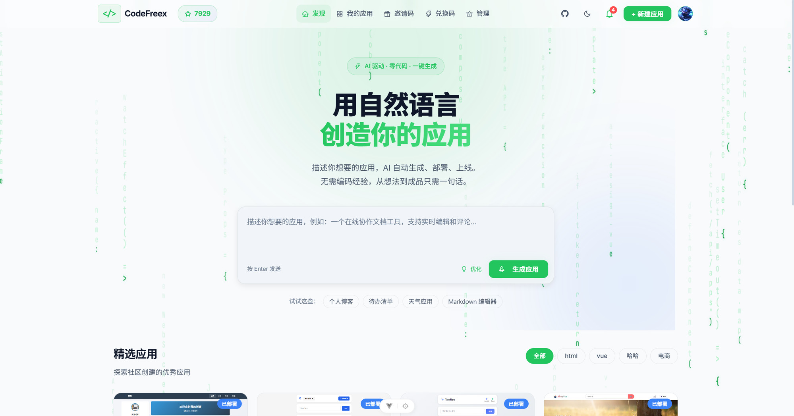
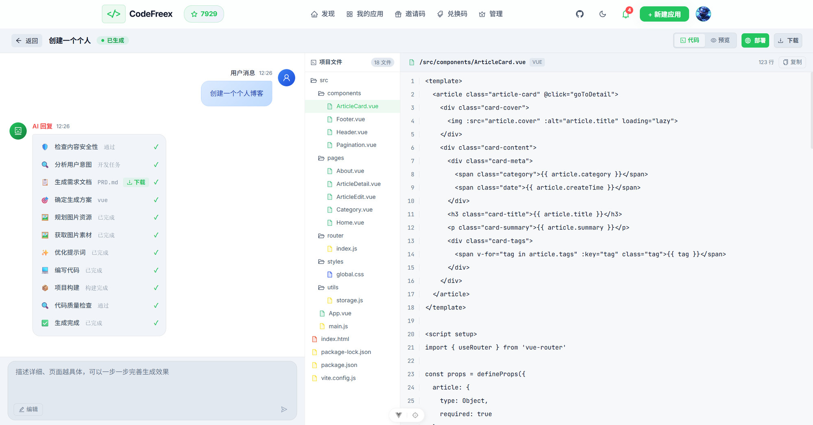
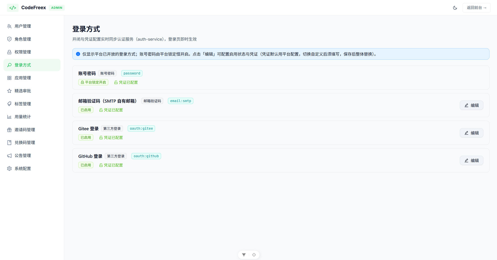
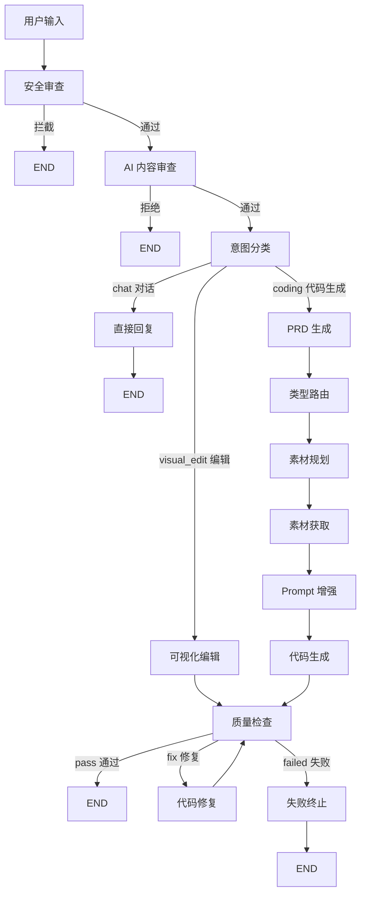

<p align="center">
  
  
  
  
  
</p>

<h1 align="center">CodeFreex</h1>

<p align="center">
  <strong>AI 驱动的零代码应用生成平台 — 后端</strong>
</p>

<p align="center">
  <a href="https://github.com/userwanyong/codefreex-frontend">前端仓库</a> · <a href="#快速开始">快速开始</a> · <a href="#功能特性">功能特性</a> · <a href="#技术栈">技术栈</a>
</p>

<br />

## 项目简介

CodeFreex 是一个 AI 驱动的零代码应用生成平台。用户只需用自然语言描述想要的应用，AI 即可自动完成需求分析、素材收集、代码生成、质量检查和构建部署，生成可直接运行的前端应用。

本仓库为 CodeFreex 的后端项目，基于 **Spring Boot 3 + LangChain4j + LangGraph4j** 构建，实现了完整的 AI 工作流编排、应用管理、用户认证、运营计费和后台管理功能。用户体系通过 Dubbo RPC 接入独立部署的 auth-service 认证服务。

## 项目速览

<p align="center">
  
</p>
<p align="center">
  
</p>
<p align="center">
  
</p>

## 核心亮点

- **14 节点 AI 工作流引擎** — 基于 LangGraph4j 编排的多步骤智能工作流，覆盖从安全审查、意图分类到代码生成、质检修复的完整链路
- **多类型代码生成** — 支持 HTML 单文件、多文件项目、Vue 完整项目三种代码生成模式，Vue 项目自动执行 npm 构建
- **AI 工具调用迭代编辑** — 可视化编辑阶段通过 Tool Calling 实现文件读写、编辑等操作，支持最多 15 轮自动迭代
- **自动质量检查与修复** — AI 自动验证生成代码质量，不通过时自动修复并重试（最多 2 次）
- **智能素材收集** — 自动从 Pexels、Pixabay 获取图片素材，支持 Mermaid 图表渲染和 AI SVG Logo 生成
- **系统配置中心** — AI 模型、图库密钥、码点计费等 20 项运行时配置数据库化管理，敏感信息脱敏展示，审查模型支持热生效
- **部署计费** — 部署应用按小时扣减码点，余额不足自动下线并站内通知，精选应用部署期间免费
- **SSE 流式响应** — 基于 Server-Sent Events 的实时流式输出，支持断线重连和事件回放
- **可视化监控** — 内置 Prometheus + Grafana 监控方案，预置 AI 模型调用仪表盘

## 功能特性

### AI 工作流

完整的 14 节点工作流管道（集中于 `service/impl/AiWorkflowServiceImpl` 编排），每个节点各司其职：


```mermaid
graph TD
    A[用户输入] --> B[安全审查]
    B -->|拦截| END1[END]
    B -->|通过| C[AI 内容审查]
    C -->|拒绝| END2[END]
    C -->|通过| D[意图分类]

    D -->|chat 对话| E[直接回复] --> END3[END]

    D -->|visual_edit 编辑| F[可视化编辑] --> M[质量检查]

    D -->|coding 代码生成| G[PRD 生成] --> H[类型路由]
    H --> I[素材规划] --> J[素材获取] --> K[Prompt 增强]
    K --> L[代码生成] --> M

    M -->|pass 通过| END4[END]
    M -->|fix 修复| N[代码修复] --> M
    M -->|failed 失败| O[失败终止] --> END5[END]
```

- **安全审查** — 关键词过滤 + AI 二次审查，双重保障
- **意图分类** — 自动识别用户意图：代码生成 / 可视化编辑 / 普通对话
- **PRD 生成** — AI 自动生成产品需求文档，指导后续代码生成
- **素材规划与获取** — 自动规划所需图片类型，从多个来源获取素材
- **代码类型路由** — AI 智能判断最适合的代码生成模式
- **流式代码生成** — 大模型流式输出代码，实时展示生成过程
- **自动修复循环** — 质量检查失败时自动修复，最多重试 2 次

### 应用管理

- 应用创建、编辑、删除
- 一键部署（Nginx 集成），已部署应用通过 `/deploy/{deployKey}` 对外访问
- 部署计费：定时任务按配置周期扣减码点，余额不足自动取消部署并站内通知
- 应用封面自动截图（Selenium 无头浏览器）
- 精选应用推荐与审批工作流（精选应用部署期间免计费）
- 应用点赞、浏览统计
- 源码查看与下载

### 用户与认证

- 接入独立 auth-service（Dubbo RPC）：支持密码、邮箱验证码、短信验证码、Gitee / GitHub OAuth 登录，登录方式由租户配置动态开关
- Bearer Token 无状态认证：`TokenAuthFilter` 解析并校验令牌，写入 `UserContext` 用户上下文
- `@AuthCheck` 注解 + AOP 角色权限控制（管理员 / 平台管理员）
- 码点体系与交易流水
- 邀请码与兑换码系统
- 个人中心账号绑定：邮箱 / 手机 / Gitee / GitHub 绑定与解绑

### 公告与通知

- 公告系统：首页弹窗展示 Markdown 公告，用户可勾选「不再提示」；管理端发布 / 更新 / 下线，公告更新后重新弹窗
- 站内通知：部署计费扣费、精选申请结果等事件通知，支持未读数查询与已读标记

### 管理后台

- 用户管理（列表、禁用、码点调整）
- 角色与权限管理（RBAC）
- 登录方式管理（各登录方式的开关与凭证配置）
- 应用管理（列表、精选推荐）与精选审批工作流
- 标签管理
- 用量统计（Token 消耗、延迟、错误率）
- 邀请码 / 兑换码批量管理
- 公告管理
- 系统配置中心（AI 模型、图库密钥、码点计费参数，按组展示与保存）

### 监控与稳定性

- Redisson 限流（`@RateLimit` 注解 + AOP），AI 生成接口另有并发任务数保护
- Spring Boot Actuator + Micrometer Prometheus 端点，自定义 `ai_model_call_duration` 等指标
- 预置 Grafana AI 监控仪表盘，Docker Compose 一键启动监控栈

## 技术栈

| 类别 | 技术 | 版本 |
|------|------|------|
| 语言 | [Java](https://openjdk.org/) | 21 |
| 框架 | [Spring Boot](https://spring.io/projects/spring-boot) | 3.5 |
| AI 编排 | [LangChain4j](https://langchain4j.dev/) | 1.13 |
| 工作流引擎 | [LangGraph4j](https://github.com/langgraph4j/langgraph4j) | 1.1 |
| ORM | [MyBatis-Flex](https://mybatis-flex.com/) | 1.11 |
| 数据库 | [MySQL](https://www.mysql.com/) | 8.x |
| 缓存 | [Redis](https://redis.io/) + [Redisson](https://redisson.org/) | — |
| 认证 | Bearer Token + auth-service（[Apache Dubbo](https://dubbo.apache.org/) RPC） | — |
| RPC | [Apache Dubbo](https://dubbo.apache.org/) | 3.3 |
| 注册中心 | [Nacos](https://nacos.io/) | 2.4 |
| API 文档 | [Knife4j](https://doc.xiaominfo.com/) (OpenAPI 3) | 4.4 |
| 对象存储 | [阿里云 OSS](https://www.aliyun.com/product/oss) | — |
| 浏览器自动化 | [Selenium](https://www.selenium.dev/) | 4.33 |
| 监控 | Micrometer + Prometheus + Grafana | — |

## 项目结构

```
src/main/java/cn/wanyj/codefreex/
├── auth/                       # 认证鉴权（接入 auth-service）
│   ├── annotation/             # @AuthCheck 自定义注解
│   ├── aspect/                 # AuthCheckAspect (AOP)
│   ├── AuthRpcClient.java      # Dubbo RPC 客户端（用户/角色/权限/令牌/登录方式）
│   ├── TokenAuthFilter.java    # Bearer Token 解析过滤器
│   └── UserContext.java        # ThreadLocal 用户上下文
├── common/                     # 公共模块（统一响应、分页 DTO）
├── config/                     # 配置类
│   ├── AiConfig.java           # LangChain4j 模型 + Prompt 配置
│   ├── ConfigurableChatModel.java  # 支持热更新的审查模型代理
│   └── ...
├── controller/                 # REST API 控制器（26 个）
├── exception/                  # 全局异常处理
├── job/                        # 定时任务
│   └── DeployBillingJob.java   # 部署计费
├── mapper/                     # MyBatis-Flex Mapper（17 个）
├── model/
│   ├── dto/
│   │   ├── request/            # 请求 DTO（25 个）
│   │   └── response/           # 响应 DTO（20 个）
│   ├── entity/                 # 数据库实体（17 张表）
│   └── enums/                  # 枚举（7 个）
├── ratelimit/                  # Redisson 限流
│   ├── annotation/             # @RateLimit 注解
│   └── aspect/                 # RateLimitAspect
├── service/                    # 业务逻辑接口（30 个）
│   ├── impl/                   # 业务实现（31 个，含 AiWorkflowServiceImpl 工作流编排）
│   ├── policy/                 # 邀请码奖励策略
│   ├── strategy/               # 策略模式
│   │   └── impl/               # 代码持久化策略（HTML/多文件/Vue 项目）
│   └── tools/                  # AI Tool Calling 文件操作工具
└── CodefreexApplication.java   # 启动类
```

### 资源文件

```
src/main/resources/
├── prompts/                    # AI Prompt 模板（17 个）
├── application.yml             # 主配置（默认激活 local profile）
├── application-local-example.yml  # 本地开发配置模板（复制为 application-local.yml 后填写，不入库）
├── application-prod.yml        # 生产配置模板（Docker 部署激活，具体值由 docker-compose-app.yml 环境变量覆盖）
└── logback-spring.xml          # 日志配置

local-libs/                     # 未开源依赖（Docker 构建自动引用）
├── auth-service-api/1.1/       # RPC 接口 jar + pom
└── auth-service-parent/1.1/    # 父 pom

docs/
├── sql/
│   ├── init.sql                # 数据库初始化脚本（17 张表 + 标签种子数据）
│   └── 1-system-config-announcement-deploy-billing.sql  # 增量变更脚本
├── grafana/                    # 独立监控栈（Prometheus + Grafana + 预置仪表盘）
└── md/                         # 设计与规划文档
```

## 快速开始

### 环境要求

- **JDK** 21+
- **Maven** 3.8+
- **MySQL** 8.x
- **Redis** 6.x+
- **Nacos** + **auth-service**（认证服务，可由下方 Docker Compose 一键启动）
- AI 模型 API Key（OpenAI 兼容接口）

### 一键启动基础设施（推荐）

根目录 `docker-compose.yml` 提供全套依赖：MySQL、Redis、Nacos、auth-service 认证服务、Prometheus、Grafana：

```bash
docker compose up -d
```

### 未开源依赖说明

后端 `pom.xml` 中存在部分暂未开源的内部依赖（`cn.wanyj.auth:auth-service-api` 等）。项目已将依赖包放置在 `local-libs/` 目录中，Docker 构建时会自动复制进镜像内 Maven 仓库。

若 Maven 本地构建时提示相关依赖无法解析，请手动安装：

```bash
mvn install:install-file \
  -Dfile=local-libs/auth-service-api/1.1/auth-service-api-1.1.jar \
  -DpomFile=local-libs/auth-service-api/1.1/auth-service-api-1.1.pom

mvn install:install-file \
  -Dfile=local-libs/auth-service-parent/1.1/auth-service-parent-1.1.pom \
  -DgroupId=cn.wanyj.auth \
  -DartifactId=auth-service-parent \
  -Dversion=1.1 \
  -Dpackaging=pom
```

> jar 使用 `-DpomFile` 安装真实 pom，以保留其父 pom 引用和传递依赖声明。

### 配置

1. 创建 MySQL 数据库，执行初始化脚本：

```bash
mysql -u root -p < docs/sql/init.sql
```

2. 复制配置模板为 `application-local.yml`（默认激活 `local` profile，该文件已被 `.gitignore` 忽略），并将 `your-xxx` 占位符替换为真实值：

```bash
cp src/main/resources/application-local-example.yml src/main/resources/application-local.yml
```

```yaml
# - MySQL / Redis 连接信息（必填）
# - AI 模型 API Key 和端点地址（必填，流式生成模型 / 审查模型两组）
# - auth-service 租户配置 tenant-uid、rpc-token（必填）
# - Nacos 地址（必填，Dubbo RPC 需要）
# - 阿里云 OSS 配置（可选）
# - Pexels / Pixabay 图库 API Key（可选，素材获取）
```

3. 启动后端服务：

```bash
mvn spring-boot:run -Dspring-boot.run.profiles=local
```

服务将在 `http://localhost:18123/api` 启动。

### API 文档

启动后访问 Swagger 文档：`http://localhost:18123/api/doc.html`

### Docker 部署（可选）

使用 `docker-compose-app.yml` 独立部署主应用，当前镜像版本 `wanyj/codefreex:5.2`（两阶段构建，运行镜像内置 Chromium 与 Node.js，支持应用截图和 Vue 项目构建）：

```bash
# 首次部署先准备数据目录
mkdir -p ./data/tmp ./data/logs
chmod -R 777 ./data

docker compose -f docker-compose-app.yml up -d --build
```

容器运行激活 `prod` profile（`application-prod.yml` 提供缺省结构），所有具体属性值以环境变量形式直接写在 `docker-compose-app.yml` 中，部署前将文件中的 `your-xxx` 占位符替换为真实值：

- **AI 模型**（必填）— 流式生成与审查模型的 API Key、Base URL、模型名
- **auth-service 租户配置**（必填）— `tenant-uid`、`rpc-token`、`frontend-url`
- **基础设施连接** — 默认指向 `docker-compose.yml` 启动的容器（`mysql` / `redis` / `nacos`，密码 `123456`），独立部署时按实际地址修改
- **OSS / 图库 Key**（可选）— 应用封面上传、素材获取

容器启动后服务监听 `http://localhost:18123/api`，内置健康检查（`/api/actuator/health`）。

### 监控部署（可选）

除基础设施 Compose 自带的监控栈外，`docs/grafana/` 还提供了一套独立监控栈：

```bash
cd docs/grafana
docker-compose up -d
```

- Prometheus: `http://localhost:9090`
- Grafana: `http://localhost:3000`（预置 AI 监控仪表盘）

## 数据库

项目使用 MySQL，共 17 张数据表：

| 表名 | 说明 |
|------|------|
| `user_info` | 用户业务档案、码点余额（身份数据存储于 auth-service） |
| `app` | 应用（名称、状态、代码、部署与计费信息） |
| `chat_history` | 对话历史 |
| `tag` / `app_tag` | 标签、应用-标签关联 |
| `invite` / `invite_user` | 邀请码 |
| `redeem` / `redeem_user` | 兑换码 |
| `credit_transaction` | 码点交易流水 |
| `app_like` | 应用点赞记录 |
| `featured_application` | 精选应用申请 |
| `notification` | 站内通知 |
| `user_usage` | AI 用量统计 |
| `system_config` | 系统配置中心 |
| `announcement` | 公告 |
| `announcement_ack` | 公告用户确认记录（「不再提示」） |

所有表支持软删除、自动时间戳和索引优化。版本间的增量表结构变更通过 `docs/sql/` 下的编号脚本提供（如 `1-system-config-announcement-deploy-billing.sql`）。

## AI 模型配置

项目通过 `application-local.yml` 配置 AI 模型，支持任何 OpenAI 兼容的 API：

```yaml
langchain4j:
  open-ai:
    streaming-chat-model:
      model-name: your-model-name
      api-key: your-api-key
      base-url: https://api.example.com/v1
```

项目使用两类模型：
- **流式生成模型** — 用于代码生成、对话回答（高 Token 上限，Temperature 0.7）
- **审查模型** — 用于安全审查、意图分类、路由判断（低 Temperature 0.3）

以上配置在启动时会播种进系统配置中心（`system_config` 表），管理员可在后台直接修改：审查模型经 `ConfigurableChatModel` 检测到配置变化后自动重建，无需重启服务。

## 相关仓库

| 仓库 | 说明 | 地址 |
|------|------|------|
| CodeFreex 前端 | Vue 3 + TypeScript + Vite + Ant Design Vue | [github.com/userwanyong/codefreex-frontend](https://github.com/userwanyong/codefreex-frontend) |

## 贡献

欢迎贡献代码！请随时提交 Issue 或 Pull Request。

## 开源协议

[MIT License](LICENSE)

---

<p align="center">
  Made with ❤️ by <a href="https://github.com/userwanyong">wanyj</a> & <a href="https://github.com/BanXia">BanXia</a>
</p>
